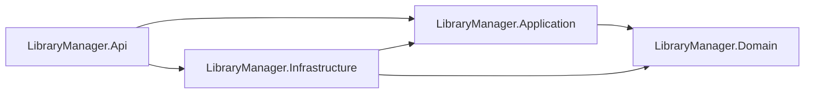
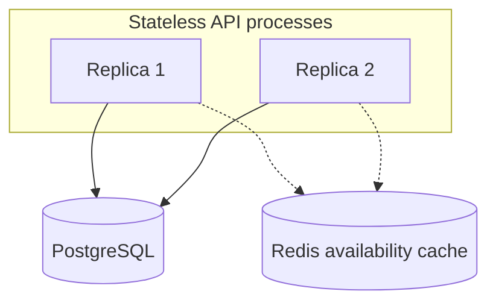
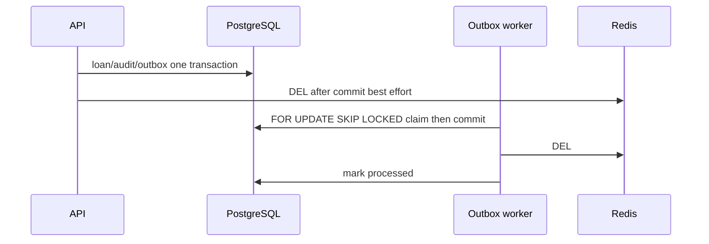

# library-manager

## Table of Contents

- [Overview](#overview)
- [Challenge Goals](#challenge-goals)
- [Key Engineering Highlights](#key-engineering-highlights)
- [Technology Stack](#technology-stack)
- [Architecture](#architecture)
- [Repository Structure](#repository-structure)
- [Prerequisites](#prerequisites)
- [Quick Start](#quick-start)
- [Local Authentication with Keycloak](#local-authentication-with-keycloak)
- [Configuration](#configuration)
- [Database and EF Core Migrations](#database-and-ef-core-migrations)
- [API Reference](#api-reference)
- [Domain and Business Rules](#domain-and-business-rules)
- [Concurrency and Consistency](#concurrency-and-consistency)
- [Idempotency](#idempotency)
- [Domain Audit Trail](#domain-audit-trail)
- [Redis Caching Strategy](#redis-caching-strategy)
- [Transactional Outbox](#transactional-outbox)
- [Error Handling and Validation](#error-handling-and-validation)
- [Localization](#localization)
- [Observability](#observability)
- [Health Checks](#health-checks)
- [Testing Strategy](#testing-strategy)
- [Docker](#docker)
- [Kubernetes](#kubernetes)
- [Why the System Remains Correct with 2–11 Replicas](#why-the-system-remains-correct-with-2-11-replicas)
- [Security Considerations](#security-considerations)
- [Dependency Security](#dependency-security)

## Overview

ASP.NET Core REST API for a library catalog, readers, and loans. PostgreSQL is the system of record for inventory, durable loan idempotency, business audit, and the transactional Outbox. Redis caches book availability for reads only. The API is a JWT resource server: it never accepts a username and password and never issues access tokens. Docker Compose runs the API with PostgreSQL, Redis, and Keycloak. Kubernetes manifests under `deploy/kubernetes/` describe the API (Deployment, Service, ConfigMap, Secret); they do not apply a live cluster by themselves.

## Challenge Goals

The challenge evaluates whether the service stays correct under concurrent lending, retries, and more than one API instance: inventory must not go negative, the same loan key must not create two loans, audit must pair with the mutation, and cache must never authorize a loan. Clean Architecture is documented because it is implemented; it is not a scoring checklist. Later production-hardening work added Result-based HTTP mapping, `en-US`/`pt-BR` user-facing text, Redis failure isolation, repository-wide NuGet audit, and Direct Access Grants disabled on the local Keycloak realm.

## Key Engineering Highlights

| Area | What is implemented |
| --- | --- |
| Concurrency | Atomic PostgreSQL conditional updates own last-copy and return/cancel inventory |
| Idempotency | Durable `Idempotency-Key` uniqueness on `POST /loans` in PostgreSQL |
| Audit | Business `AuditEvent` in the same transaction as the mutation |
| Cache | Redis cache-aside for availability GET; PostgreSQL remains source of truth |
| Reliability | Transactional Outbox retries cache invalidation after commit |
| Identity | External OIDC / JWT; Librarian role for mutations; Swagger Authorization Code + PKCE |
| Observability | Structured logs, `X-Correlation-ID`, OpenTelemetry (`ActivitySource` / meter `LibraryManager`) |
| Tests | Unit tests plus integration tests against real PostgreSQL and Redis (Testcontainers) |

## Technology Stack

| Layer | Technology |
| --- | --- |
| Runtime | .NET 10 (`net10.0`), C# |
| HTTP | ASP.NET Core Web API, Swashbuckle (Development) |
| Persistence | Entity Framework Core, Npgsql, PostgreSQL 16 (`postgres:16-alpine` locally) |
| Cache | StackExchange.Redis, Redis 7 (`redis:7-alpine` locally) |
| Identity | JWT Bearer, Keycloak 26.7.2 (Compose only) |
| Telemetry | OpenTelemetry (OTLP when `OpenTelemetry__OtlpEndpoint` is set) |
| Tests | xUnit, `WebApplicationFactory`, Testcontainers |
| Containers | Docker Compose, `Dockerfile` (sdk/aspnet 10.0 images) |
| Cluster baseline | Kubernetes manifests in `deploy/kubernetes/` |

Solution file: `LibraryManager.sln`. Repository-wide NuGet audit is enabled in `Directory.Build.props`.

## Architecture

The four production layers are `LibraryManager.Domain`, `LibraryManager.Application`, `LibraryManager.Infrastructure`, and `LibraryManager.Api`. Tests live in `LibraryManager.UnitTests` and `LibraryManager.IntegrationTests`.

`LibraryManager.Api` is the composition root (`src/LibraryManager.Api/Program.cs`): HTTP, JWT, Swagger, health, localization, and DI. Controllers call explicit Application UseCase classes. HTTP request and response types live under `LibraryManager.Api/Contracts/`. `LibraryManager.Infrastructure` implements Application abstractions (EF Core, Redis, idempotency store, Outbox). `LibraryManager.Domain` has no ASP.NET Core, EF, Redis, or OpenTelemetry package references. Dependencies point inward.



The solution does not use CQRS, MediatR, Command/Query/Handler types, or a Generic Repository.

## Repository Structure

```text
library-manager/
  LibraryManager.sln
  Directory.Build.props
  Dockerfile
  docker-compose.yml
  README.md
  src/
    LibraryManager.Domain/
    LibraryManager.Application/
    LibraryManager.Infrastructure/   # EF migrations, Redis, Outbox, SQL
    LibraryManager.Api/              # Controllers, Contracts, Program.cs
  tests/
    LibraryManager.UnitTests/
    LibraryManager.IntegrationTests/
  infrastructure/keycloak/           # local realm import
  deploy/kubernetes/                 # API manifests only
  specs/                             # feature specifications
```

## Prerequisites

- Docker and Docker Compose (primary local path)
- .NET 10 SDK if you build or test on the host
- Git

## Quick Start

```bash
git clone https://github.com/ronilsonsilva/library-manager.git
cd library-manager
docker compose up --build
```

| Service | Address |
| --- | --- |
| API | http://localhost:8080 |
| Swagger UI (Compose sets `ASPNETCORE_ENVIRONMENT=Development`) | http://localhost:8080/swagger |
| Keycloak | http://localhost:8081 |
| Liveness | http://localhost:8080/health/live |
| Readiness | http://localhost:8080/health/ready |
| PostgreSQL | localhost:5432 |
| Redis | localhost:6379 |

Compose services: `library-manager-api`, `postgres`, `redis`, `keycloak`. The API waits until Postgres and Redis are healthy and Keycloak has started. Named volume: `postgres_data`.

Stop containers (keep the volume):

```bash
docker compose down
```

Stop and delete local Postgres data:

```bash
docker compose down -v
```

Host alternatives (SDK required; Compose still supplies Postgres, Redis, and Keycloak for a full stack):

```bash
dotnet build
dotnet test
dotnet test tests/LibraryManager.UnitTests
dotnet test tests/LibraryManager.IntegrationTests
```

`GET /health/live` is process-only and stays HTTP 200 while the process is running. `GET /health/ready` checks PostgreSQL and Redis (not Keycloak) and returns HTTP 503 when a dependency is down. Health bodies use the ASP.NET default writer, not Problem Details.

Swagger UI is registered only in Development. Production-style hosts do not serve `/swagger` unless that environment is Development.

## Local Authentication with Keycloak

Local identity is Keycloak (Compose). The API is a resource server: it validates JWTs and never exposes a login or token endpoint.

1. Open http://localhost:8080/swagger
2. Authorize with client `library-manager-swagger`
3. Flow: Authorization Code with PKCE (`S256`). Scopes: `openid`, `profile`
4. Redirect URI: `http://localhost:8080/swagger/oauth2-redirect.html`
5. Sign in as the local librarian (credentials below)

The browser talks to Keycloak at `http://localhost:8081/realms/library-manager`. The API container loads OIDC metadata from Compose DNS (`Authentication__MetadataAddress` → `keycloak`) and validates `iss` against the configured authority and extra valid issuers. Audience is `library-manager-api`. Role claim type is `roles`; mutations require the `librarian` role (policy `Librarian`).

Do **not** build JWTs by hand for this flow. Direct Access Grants are disabled on every client in `infrastructure/keycloak/library-manager-realm.json`. Do not use Resource Owner Password Credentials against Keycloak as a documented login or smoke path.

Realm import uses `start-dev --import-realm`. If the realm already exists in the container, import is skipped; recreate the Keycloak container (or reset volumes as needed) to reimport.

### Local-only development credentials

**Docker Compose only. Do not use these values in production, CI secrets, or Kubernetes.**

| Use | Username | Password |
| --- | --- | --- |
| Keycloak Admin Console (`http://localhost:8081`) | `admin` | `admin-dev-only` |
| Librarian (Swagger PKCE) | `librarian` | `librarian-dev-only` |
| PostgreSQL (`library_manager`) | `postgres` | `postgres` |
| Redis | (none) | (none) |

Mutations without a Bearer token return HTTP 401. An authenticated caller without role `librarian` returns HTTP 403. JWT 401/403 Problem Details titles are English and are not selected by `Accept-Language`.

Integration tests use a test authentication scheme when `Testing__UseTestAuth` is true. Compose and Kubernetes set that flag to `false`. Enabling it in Production throws at startup.

## Configuration

Names come from application configuration, Compose, and Kubernetes. Nested JSON uses `__` in environment variables. There is no `Jwt:` section and no `OTEL_*` keys; OTLP is `OpenTelemetry__OtlpEndpoint` only.

| Variable | Purpose | Required | Secret | Local example / source |
| --- | --- | --- | --- | --- |
| `ASPNETCORE_ENVIRONMENT` | Host environment; Swagger in Development | Typical | No | Compose: `Development`. Kubernetes: `Production` |
| `ASPNETCORE_URLS` | Bind URLs | Typical | No | `http://+:8080` |
| `ConnectionStrings__Postgres` | EF Core and ready check | Yes (runtime) | Yes | Compose: `Host=postgres;Port=5432;Database=library_manager;Username=postgres;Password=postgres` (local only) |
| `ConnectionStrings__Redis` | Availability cache and ready check | Yes (runtime) | Context-dependent | Compose: `redis:6379` |
| `Authentication__Authority` | JWT issuer / OIDC authority | Yes unless TestAuth | No | Compose: `http://localhost:8081/realms/library-manager` |
| `Authentication__Audience` | JWT audience | Yes unless TestAuth | No | `library-manager-api` |
| `Authentication__MetadataAddress` | OIDC discovery URL (container DNS) | No | No | Compose: `http://keycloak:8080/realms/library-manager/.well-known/openid-configuration` |
| `Authentication__ValidIssuers__0` | Extra valid `iss` | No | No | Compose: `http://localhost:8081/realms/library-manager` |
| `Authentication__ValidIssuers__1` | Extra valid `iss` | No | No | Compose: `http://keycloak:8080/realms/library-manager` |
| `Testing__UseTestAuth` | In-process test auth; forbidden in Production | No (default false) | No | Compose and Kubernetes: `false` |
| `Database__ApplyMigrations` | Run EF `MigrateAsync` on startup | No; also true when environment is Development | No | Compose: `true`. Kubernetes: `false` |
| `Outbox__ProcessorEnabled` | Background Outbox worker | No (enabled unless `"false"`) | No | `appsettings.json`: `true` |
| `Outbox__BatchSize` | Claim batch size | No | No | `10` |
| `Outbox__LeaseSeconds` | Claim lease | No | No | `30` |
| `Outbox__PollIntervalMilliseconds` | Poll interval | No | No | `2000` |
| `Outbox__MaxBackoffSeconds` | Retry backoff cap | No | No | `60` |
| `OpenTelemetry__OtlpEndpoint` | OTLP export URI | No; empty disables export | No | `appsettings.json`: empty |

Kubernetes ConfigMap `library-manager-api` supplies `Authentication__Authority` and `Authentication__Audience`. Secret `library-manager-api` supplies connection strings as `REPLACE_WITH_*` placeholders — do not commit production passwords.

Compose also sets Keycloak `KC_*` and Postgres `POSTGRES_*` for those containers; they are not API settings.

If connection strings are omitted, the process falls back to localhost Postgres/Redis in code. Prefer the Compose or Kubernetes values above.

## Database and EF Core Migrations

PostgreSQL is the system of record. Schema is owned by EF Core in `src/LibraryManager.Infrastructure`. The current migration is `20260826022736_InitialCreate` (tables include `books`, `users`, `loans`, `audit_events`, `idempotency_entries`, `outbox_messages`).

On startup the API calls `MigrateAsync` when the environment is Development **or** `Database__ApplyMigrations` is true. Compose sets the flag to `true`. The Kubernetes Deployment sets it to `false`; apply migrations out of band so replicas do not race schema updates.

From the host, with PostgreSQL reachable:

```bash
dotnet ef database update --project src/LibraryManager.Infrastructure --startup-project src/LibraryManager.Api
```

To add a new schema version from the solution root:

```bash
dotnet ef migrations add <Name> --project src/LibraryManager.Infrastructure --startup-project src/LibraryManager.Api
```

## API Reference

Production HTTP surface from the current controllers, API contracts, and `specs/001-library-manager/contracts/openapi.yaml`. Routes and methods match those sources. Book update is **PUT**, not PATCH. There is no `GET /users`, `GET /users/{id}`, `GET /loans`, `GET /loans/{id}`, unsuffixed `GET /health`, or token-issuing route.

JSON uses camelCase. Send `Authorization: Bearer <access_token>` except on health. Optional request header `X-Correlation-ID`: if it matches `^[A-Za-z0-9._-]{1,128}$` it is echoed; if it is missing or does not match, the API generates a GUID. The chosen value is returned on every response. An invalid header is not rejected with 400.

| Authorization | Meaning |
| --- | --- |
| Librarian | Policy `Librarian` (JWT role `librarian`) |
| Authenticated | Any valid access token (`[Authorize]`) |
| Anonymous | No token |

Test-only routes are **not** public API: `GET /security/me` and `POST /security/librarian-probe` (only when `Testing__UseTestAuth` is true) and `GET /__test/unexpected-error` (only environment `Testing`).

Business failures use `application/problem+json`. `ResultHttpMapper` maps domain errors as: validation **400**, not found **404**, conflict **409**, business rule **422**. JWT challenge/forbidden use **401** / **403** with English titles. Transport validation (`[ApiController]`, DataAnnotations, `Idempotency-Key` binder) also returns **400** `ValidationProblemDetails`.

Paged JSON envelope (C# type `PagedResponse<T>`; OpenAPI names such as `BookListResponse` describe the same fields):

```json
{
  "items": [],
  "page": 1,
  "pageSize": 20,
  "totalCount": 0
}
```

Query `page` defaults to **1**. Query `pageSize` defaults to **20** and is **clamped** to a maximum of **100** (oversized values are not rejected with 400).

### Summary

| Method | Route | Authorization | Purpose |
| --- | --- | --- | --- |
| POST | `/books` | Librarian | Create a catalog book |
| GET | `/books` | Authenticated | List books (paged; optional `isActive`) |
| GET | `/books/{id}` | Authenticated | Get a book by id |
| GET | `/books/{id}/availability` | Authenticated | Availability view (cache-aside; not used to authorize loans) |
| GET | `/books/{id}/loans` | Authenticated | Loan history for the book (paged) |
| GET | `/books/{id}/history` | Authenticated | Alias of `GET /books/{id}/loans` (same action) |
| PUT | `/books/{id}` | Librarian | Replace title, author, and totalCopies (ISBN is not in the body) |
| DELETE | `/books/{id}` | Librarian | Logical deactivation (**204**) |
| POST | `/users` | Librarian | Register a library user (reader) |
| GET | `/users/{id}/loans` | Authenticated | Loan history for the user (paged) |
| POST | `/loans` | Librarian | Create a loan; requires `Idempotency-Key` |
| POST | `/loans/{id}/return` | Librarian | Return an active loan |
| POST | `/loans/{id}/cancel` | Librarian | Cancel an active loan |
| GET | `/audit-events` | Librarian | List business audit events (paged) |
| GET | `/health/live` | Anonymous | Process liveness (not Problem Details) |
| GET | `/health/ready` | Anonymous | PostgreSQL + Redis readiness (not Keycloak) |

### Create Book

`POST /books` — Librarian.

**Request body** (`CreateBookRequest`): `title` (required, max 500), `isbn` (required, max 32), `author` (required, max 500), `totalCopies` (integer ≥ 1).

**Success:** **201** `BookResponse` and `Location` of `GET /books/{id}`.

**Errors:** **400** transport validation; **401**; **403**; **422** duplicate ISBN (`Book.DuplicateIsbn`).

```http
POST /books HTTP/1.1
Host: localhost:8080
Authorization: Bearer <access_token>
Content-Type: application/json

{
  "title": "Domain-Driven Design",
  "isbn": "9780321125217",
  "author": "Eric Evans",
  "totalCopies": 3
}
```

```json
{
  "id": "3fa85f64-5717-4562-b3fc-2c963f66afa6",
  "title": "Domain-Driven Design",
  "isbn": "9780321125217",
  "author": "Eric Evans",
  "totalCopies": 3,
  "availableCopies": 3,
  "isActive": true,
  "createdAtUtc": "2026-08-27T12:00:00Z",
  "updatedAtUtc": "2026-08-27T12:00:00Z"
}
```

### List Books

`GET /books` — Authenticated.

**Query:** `page`, `pageSize`, optional `isActive`.

**Success:** **200** paged `BookResponse`. **Errors:** **401**.

### Get Book

`GET /books/{id}` — Authenticated. Path `id` is a GUID.

**Success:** **200** `BookResponse`. **Errors:** **401**; **404** (`Book.NotFound`).

### Get Book Availability

`GET /books/{id}/availability` — Authenticated (Librarian is not required). This is a read model; loan create does not consult Redis.

**Success:** **200** `BookAvailabilityResponse`: `bookId`, `availableCopies`, `totalCopies`, `isActive`.

**Errors:** **401**; **404** (`Book.NotFound`).

```json
{
  "bookId": "3fa85f64-5717-4562-b3fc-2c963f66afa6",
  "availableCopies": 2,
  "totalCopies": 3,
  "isActive": true
}
```

### Get Book Loan History

`GET /books/{id}/loans` and `GET /books/{id}/history` — Authenticated. Both attributes map to the same action.

**Query:** `page`, `pageSize`.

**Success:** **200** paged `LoanResponse` (includes Active, Returned, and Cancelled). **Errors:** **401**; **404** if the book does not exist.

### Update Book

`PUT /books/{id}` — Librarian. This is a full catalog update of the fields below, **not** HTTP PATCH and **not** a partial merge. ISBN cannot be changed through this operation.

**Request body** (`UpdateBookRequest`): `title` (required, max 500), `author` (required, max 500), `totalCopies` (integer ≥ 1). No `isbn`.

**Success:** **200** `BookResponse`.

**Errors:** **400** transport validation or `totalCopies` &lt; 1 (`Book.TotalCopiesInvalid`); **401**; **403**; **404** (`Book.NotFound`); **422** when `totalCopies` is below copies currently borrowed (`Book.TotalCopiesBelowBorrowed`).

```http
PUT /books/3fa85f64-5717-4562-b3fc-2c963f66afa6 HTTP/1.1
Host: localhost:8080
Authorization: Bearer <access_token>
Content-Type: application/json

{
  "title": "Domain-Driven Design",
  "author": "Eric Evans",
  "totalCopies": 4
}
```

### Deactivate Book

`DELETE /books/{id}` — Librarian. Logical deactivation (the row remains). Already-inactive books still return **204**.

**Success:** **204** No Content (no body). **Errors:** **401**; **403**; **404** (`Book.NotFound`).

### Create User

`POST /users` — Librarian.

**Request body** (`CreateUserRequest`): `name` (required, max 200), `email` (required, max 320; stored lowercased).

**Success:** **201** `UserResponse`. There is **no** `Location` header.

**Errors:** **400** transport validation; **401**; **403**; **422** duplicate email (`User.DuplicateEmail`).

```http
POST /users HTTP/1.1
Host: localhost:8080
Authorization: Bearer <access_token>
Content-Type: application/json

{
  "name": "Ada Lovelace",
  "email": "ada@example.com"
}
```

```json
{
  "id": "7c9e6679-7425-40de-944b-e07fc1f90ae7",
  "name": "Ada Lovelace",
  "email": "ada@example.com",
  "createdAtUtc": "2026-08-27T12:00:00Z"
}
```

### Get User Loans

`GET /users/{id}/loans` — Authenticated.

**Query:** `page`, `pageSize`.

**Success:** **200** paged `LoanResponse` (full history). **Errors:** **401**; **404** if the user does not exist (`User.NotFound`).

### Create Loan

`POST /loans` — **Librarian**.

Creates an Active loan. `dueAtUtc` is `borrowedAtUtc` plus **14** days (UTC). Return and cancel do **not** use this header.

**Header `Idempotency-Key` (required):** name is exactly `Idempotency-Key`. The value is trimmed; length after trim must be **1–128**. Missing, empty, whitespace-only, or longer than 128 characters fail in the model binder and return automatic transport-validation **400** before the use case runs. Uniqueness is per endpoint `"POST /loans"` plus key. Canonical hash is SHA-256 (hex, lowercase) of camelCase JSON `{"bookId":"<guid>","userId":"<guid>"}`.

**Request body** (`CreateLoanRequest`):

```json
{
  "bookId": "3fa85f64-5717-4562-b3fc-2c963f66afa6",
  "userId": "7c9e6679-7425-40de-944b-e07fc1f90ae7"
}
```

**Success:** **201 Created** `LoanResponse` for a new loan **and** for a same-key, same-hash replay (stored body; no second loan). No `Location` header (`ToCreatedResult`).

| Status | When |
| --- | --- |
| **201** | Created, or idempotent replay of a prior successful create |
| **400** | Automatic transport validation: missing/invalid `Idempotency-Key`, invalid JSON, or DataAnnotations on the body |
| **401** | Missing or invalid Bearer token |
| **403** | Authenticated caller without role `librarian` |
| **404** | Unknown `bookId` (`Book.NotFound`) or `userId` (`User.NotFound`) |
| **409** | Same `Idempotency-Key` with a different canonical payload (`Idempotency.PayloadMismatch`) |
| **422** | Business rule: inactive book (`Book.Inactive`), no remaining copies (`Book.Unavailable`), or the user already has an Active loan for the book (`Loan.DuplicateActive`) |

```http
POST /loans HTTP/1.1
Host: localhost:8080
Authorization: Bearer <access_token>
Idempotency-Key: loan-create-ada-ddd-001
Content-Type: application/json

{
  "bookId": "3fa85f64-5717-4562-b3fc-2c963f66afa6",
  "userId": "7c9e6679-7425-40de-944b-e07fc1f90ae7"
}
```

```json
{
  "id": "9b1deb4d-3b7d-4bad-9bdd-2b0d7b3dcb6d",
  "bookId": "3fa85f64-5717-4562-b3fc-2c963f66afa6",
  "userId": "7c9e6679-7425-40de-944b-e07fc1f90ae7",
  "status": "Active",
  "borrowedAtUtc": "2026-08-27T12:00:00Z",
  "dueAtUtc": "2026-09-10T12:00:00Z",
  "returnedAtUtc": null,
  "cancelledAtUtc": null
}
```

Example **409** problem (extensions `code` and `correlationId` are serialized on the JSON object):

```json
{
  "title": "Conflict",
  "status": 409,
  "detail": "Idempotency-Key was reused with a different request.",
  "instance": "/loans",
  "code": "Idempotency.PayloadMismatch",
  "correlationId": "3fa85f64-5717-4562-b3fc-2c963f66afa6"
}
```

(`title` / `detail` above are the default `en-US` resources; `code` is stable.)

`status` on `LoanResponse` is `Active`, `Returned`, or `Cancelled`.

### Return Loan

`POST /loans/{id}/return` — Librarian. Not key-idempotent. Completes only when the loan is Active (conditional update).

**Success:** **200** `LoanResponse` (`status` `Returned`, `returnedAtUtc` set).

**Errors:** **401**; **403**; **404** (`Loan.NotFound`); **422** loan is not Active (`Loan.InvalidState`).

### Cancel Loan

`POST /loans/{id}/cancel` — Librarian. Not key-idempotent. Same Active-only completion as return.

**Success:** **200** `LoanResponse` (`status` `Cancelled`, `cancelledAtUtc` set).

**Errors:** **401**; **403**; **404** (`Loan.NotFound`); **422** (`Loan.InvalidState`).

### List Audit Events

`GET /audit-events` — Librarian.

**Query:** `page`, `pageSize`, optional `entityType`, optional `entityId` (GUID).

**Success:** **200** paged `AuditEventResponse`: `id`, `entityType`, `entityId`, `action`, `actorId`, `occurredAtUtc`, `correlationId`, `dataJson`.

**Errors:** **401**; **403**. This list route does not return 404 for “no rows”; an empty `items` array is a successful page.

### Health

| Method | Route | Authorization | Success | Failure |
| --- | --- | --- | --- | --- |
| GET | `/health/live` | Anonymous | **200** while the process is running (does not check PostgreSQL or Redis) | — |
| GET | `/health/ready` | Anonymous | **200** if PostgreSQL and Redis respond within 2s | **503** if a tagged check fails |

Health bodies use the ASP.NET default health writer, **not** Problem Details. Readiness does **not** check Keycloak.

## Domain and Business Rules

The domain model is `Book`, `User` (library reader), `Loan`, and `AuditEvent`. These rules live in `LibraryManager.Domain` and are enforced again in PostgreSQL where uniqueness or inventory must survive concurrent processes.

**Book.** Title (max 500), ISBN (max 32, unique `ux_books_isbn`), author (max 500), `totalCopies` ≥ 1, `availableCopies` between 0 and `totalCopies`. Creating a book sets available copies equal to total copies. `DELETE /books/{id}` is a logical deactivation (`isActive = false`); the row remains. ISBN is not updatable via `PUT`. Reducing `totalCopies` below copies currently borrowed is rejected (`Book.TotalCopiesBelowBorrowed`).

**User.** This is a catalog reader (`name` max 200, `email` max 320, unique `ux_users_email`, stored lowercased). It is **not** the JWT subject. Audit `actorId` is the token `sub`. A librarian’s `sub` and a `User.Id` are different identifiers.

**Loan.** Status is `Active`, `Returned`, or `Cancelled`. `dueAtUtc` is `borrowedAtUtc` plus 14 days. At most one **Active** loan exists per (`userId`, `bookId`) (`ux_loans_user_book_active`). Return and cancel succeed only while status is `Active`. Lending an inactive book or a book with no remaining copies is a business-rule failure.

**AuditEvent.** A business fact: entity type/id, action, actor, UTC time, correlation id, JSON context. It is not an application log line.

Check constraints include `available_copies >= 0`, `available_copies <= total_copies`, and `total_copies >= 1`.

## Concurrency and Consistency

Inventory correctness is a **PostgreSQL** problem. API processes are stateless. Redis is not consulted when creating, returning, or cancelling a loan, and it is not used as a lock manager.



### Why read-modify-write is unsafe

A last-copy race looks like: both replicas `SELECT available_copies` and see `1`, both decide they may lend, both write `0` (or `-1`). That check-then-act window is not atomic. The implemented path is a **single conditional UPDATE** whose row count is the permission to lend.

### Last copy (loan create)

Conceptual form of `BookRepository.TryReserveAvailabilityAsync` (parameterized interpolated SQL):

```sql
UPDATE books
SET available_copies = available_copies - 1,
    updated_at_utc = @now
WHERE id = @bookId
  AND is_active = TRUE
  AND available_copies > 0
```

Exactly one concurrent last-copy request gets `rows = 1` and may insert the loan. The other gets `rows = 0` and returns **422** `Book.Unavailable`. The check constraint `available_copies >= 0` is a backstop, not the decision mechanism.

### Return, cancel, and total copies

Return and cancel complete the loan only if it is still Active:

```sql
UPDATE loans
SET status = @terminal,  -- Returned or Cancelled
    returned_at_utc = @now   -- or cancelled_at_utc
WHERE id = @loanId
  AND status = 'Active'
```

One winner (`rows = 1`) restores inventory with:

```sql
UPDATE books
SET available_copies = available_copies + 1,
    updated_at_utc = @now
WHERE id = @bookId
  AND available_copies < total_copies
```

Changing catalog size uses one UPDATE so the new total is at least copies currently borrowed (`total_copies - available_copies`).

Loan create, return/cancel, audit, and Outbox rows run inside `IUnitOfWork.ExecuteInTransactionAsync`. Redis `DEL` runs **after** that transaction commits (best effort; see Outbox).

### Why application and Redis locks are not used

In-process locks do not coordinate two API hosts. A Redis lock would still not be the system of record: lock expiry, Redis outage, or a partition could disagree with PostgreSQL. Conditional SQL already serializes last-copy, return/cancel, and total-copy updates. Application-level and Redis locks are unnecessary for those invariants.

## Idempotency

Durable idempotency applies only to **`POST /loans`**. Header name: **`Idempotency-Key`**. After trim, length is 1–128; otherwise the binder returns **400** before the use case. Return and cancel are **not** key-idempotent; they use the Active-row UPDATE above.

Uniqueness is `(endpoint, key)` with endpoint `"POST /loans"`:

```sql
INSERT INTO idempotency_entries (id, endpoint, key, request_hash, created_at_utc)
VALUES (@id, 'POST /loans', @key, @hash, @now)
ON CONFLICT (endpoint, key) DO NOTHING
```

The owner is `inserted = 1`. The hash is SHA-256 (hex, lowercase) of camelCase JSON `{"bookId":"<guid>","userId":"<guid>"}`. The winner stores HTTP **201** and the `LoanDto` JSON in the same business transaction; a later same-hash request returns that body without inserting a second loan.

| Case | HTTP | Database |
| --- | --- | --- |
| Same key, same payload (sequential) | **201** stored body | One loan |
| Same key, different `bookId`/`userId` hash | **409** `Idempotency.PayloadMismatch` | Second lend not applied |
| Same key, same payload, concurrent requests | Both **201**, **same loan id** | Copies decremented once |
| Missing / empty / whitespace / length > 128 | **400** | No loan |
| Owner reserved, no stored 201 body yet (in progress or crash mid-flight) | Unexpected **500** (`InvalidOperationException`) | Not a wait/retry-after API |

If the create transaction rolls back after a reservation, the key row rolls back with it, so a later retry can become owner (covered by an integration test). There is no key TTL.

## Domain Audit Trail

Business audit is a table (`audit_events`), not stdout. Successful mutations persist an `AuditEvent` in the **same database transaction** as the book, user, or loan change. A rejected mutation does not write a success audit (for example no `LoanCreated` when lend fails).

| Action | Entity |
| --- | --- |
| `BookCreated`, `BookUpdated`, `BookDeactivated` | Book |
| `UserCreated` | User |
| `LoanCreated`, `LoanReturned`, `LoanCancelled` | Loan |

Fields: `actorId` (JWT `sub`), `occurredAtUtc` (clock UTC), `correlationId` (from `X-Correlation-ID` / generated id), `dataJson` (compact context such as book/user ids or due date). `GET /audit-events` is Librarian-only.

Technical logs (JSON console, exception handler) are a separate channel.

## Redis Caching Strategy

**PostgreSQL is the system of record.** Redis is a performance optimization for `GET /books/{id}/availability` only.

| Item | Value |
| --- | --- |
| Key | `library-manager:books:{bookId}:availability` |
| TTL | 60 seconds |
| Pattern | Cache-aside: GET Redis; on miss load PostgreSQL and SET |
| Loan path | Create/return/cancel **never read** Redis to decide inventory |

A cache hit can be **stale** relative to `GET /books/{id}` until TTL expiry or invalidation. Tests show a stale Redis payload cannot approve or block `POST /loans`; the lend still uses the conditional PostgreSQL UPDATE.

After a successful inventory mutation the API calls `RemoveAsync` **post-commit**. If that `DEL` fails, the HTTP mutation still succeeds and an Outbox row remains to retry invalidation.

### Redis outage behavior

`ResilientAvailabilityCacheDecorator` wraps the Redis client for HTTP use cases:

- **GET** failure (`RedisException` / timeout) → treated as a **miss**; the use case reads PostgreSQL. Integration test `Redis_unavailable_does_not_break_availability_and_matches_postgres` asserts the availability JSON matches the catalog book from PostgreSQL.
- **SET** failure → logged and ignored; GET still returns PostgreSQL data (`Redis_set_failure_does_not_fail_postgres_backed_availability`).
- **REMOVE** failure → logged; metric `library_manager_cache_invalidation_failures` increments; the business transaction is not rolled back (`Loan_succeeds_when_immediate_cache_invalidation_fails`).

Do not treat Redis health as a lending gate. Readiness still checks Redis so operators notice cache/dependency issues; that is separate from loan correctness.

### Book-deactivation cache invalidation

`DELETE /books/{id}` deactivates in PostgreSQL, writes `BookDeactivated` audit and a `BookAvailabilityChanged` Outbox message in the same transaction, then `RemoveAsync` after commit. Tests assert the cached **active** payload is not left as the GET result (`Deactivation_clears_cached_active_availability_and_persists_outbox`). A Redis REMOVE failure does not roll back deactivation; Outbox recovers the `DEL`.

## Transactional Outbox

Immediate Redis `DEL` after commit can be lost if the process crashes. The implemented recovery is a **transactional Outbox**, not a future design.

On lend, return, cancel, total-copy change, and deactivation, the use case adds an `outbox_messages` row (`type` `BookAvailabilityChanged`, payload `{ bookId, correlationId }`) through the same `DbContext` / transaction as the business rows. If the transaction rolls back, the Outbox row rolls back with it.

A background `OutboxProcessor` (enabled unless `Outbox__ProcessorEnabled` is `"false"`) claims work, then talks to Redis. Integration hosts disable the hosted loop and call `ProcessBatchAsync` directly.



**Claiming (multi-replica):** `OutboxClaimer` selects due, unlocked rows with `FOR UPDATE SKIP LOCKED`, sets `locked_by`, `locked_until_utc` (lease, default 30s), increments `attempt_count`, and **commits that claim transaction before** Redis I/O. Two workers therefore take distinct messages. Expired leases (`locked_until_utc < now`) can be taken by another worker.

**Processing:** The processor is injected with the **raw** keyed Redis cache (not the resilient decorator) so a failed `DEL` throws, the row is scheduled for retry, and `library_manager_outbox_failures` increments. Backoff is `min(maxBackoff, 2^(attemptCount-1))` seconds, cap default 60s. Success sets `processed_at_utc` and clears the lease.

**At-least-once:** Redis `DEL` is idempotent. Duplicate processing is safe. Unknown `type` values skip Redis `DEL` (logged) and are then marked processed so they are not retried.

This Outbox exists so **cache** converges. It does not authorize loans.

## Error Handling and Validation

Use cases return `Result` / `Result<T>` with `Error.Code` and `Error.Type` (`LibraryManager.Domain`). Controllers do not throw for expected business outcomes. `ResultHttpMapper` maps:

| `Error.Type` | HTTP | Typical examples |
| --- | --- | --- |
| Validation | **400** | Domain validation (e.g. `totalCopies` &lt; 1 after the binder) |
| NotFound | **404** | Unknown book, user, or loan |
| Conflict | **409** | `Idempotency.PayloadMismatch` only on `POST /loans` |
| BusinessRule | **422** | No copies, inactive book, duplicate ISBN/email, loan not Active, total below borrowed |

Transport validation (`[ApiController]`, DataAnnotations, `Idempotency-Key` binder) returns **400** `ValidationProblemDetails` (`InvalidModelStateResponseFactory`). Unexpected exceptions go through `ApiExceptionHandler` as **500** Problem Details.

Problem JSON includes `status`, localized `title`/`detail`, `instance`, extension `code` (stable English identifier such as `Book.Unavailable`), and `correlationId`.

## Localization

Supported UI cultures: **`en-US`** (default) and **`pt-BR`**, selected from `Accept-Language` (`AcceptLanguageHeaderRequestCultureProvider`). DataAnnotation and Result problem titles/details use `SharedResource`. Response culture is applied to headers (`ApplyCurrentCultureToResponseHeaders`). Integration tests cover Accept-Language for validation and business-rule problems.

**Not localized:** error **codes** in Problem `code` / logs remain English identifiers. JWT **401** / **403** titles and details are hardcoded English (`Unauthorized` / `Forbidden`) and are not selected by `Accept-Language`.

## Observability

JSON console logs include scopes and UTC timestamps (`yyyy-MM-ddTHH:mm:ss.fffZ`). `X-Correlation-ID` is stored on `ICorrelationContext` and echoed on the response using the accepted or generated value. Middleware tags `Activity.Current` with that same value.

Traces use `ActivitySource` name `LibraryManager` (ASP.NET Core, HttpClient, Npgsql, plus cache spans `availability_cache.get|set|remove`). Metrics use meter `LibraryManager`. OTLP export for traces, metrics, and logs runs only when `OpenTelemetry__OtlpEndpoint` is non-empty. Service resource name: `library-manager`.

| Instrument | Kind | Tests assert? |
| --- | --- | --- |
| `library_manager_loans_created` | Counter | Yes |
| `library_manager_loans_unavailable` | Counter | Yes |
| `library_manager_loan_duration` | Histogram (ms) | Yes |
| `library_manager_cache_invalidation_failures` | Counter | Yes |
| `library_manager_idempotency_replays` | Counter | No |
| `library_manager_outbox_processed` | Counter | No |
| `library_manager_outbox_failures` | Counter | No |
| `library_manager_outbox_pending` | Observable gauge | No |

Cache span names are covered by unit tests. This README does not claim tests for OTLP export.

## Health Checks

| Endpoint | What it measures | Typical status |
| --- | --- | --- |
| `GET /health/live` | Process only (`Predicate = _ => false` — **no** dependency checks) | **200** while the process is running, including when PostgreSQL or Redis is down |
| `GET /health/ready` | NpgSql + Redis, 2s timeout, tag `ready` | **200** if both pass; **503** if either fails. **Does not check Keycloak** |

Bodies use the ASP.NET default health writer, not Problem Details. Anonymous access. Kubernetes probe paths in `deploy/kubernetes/` match these routes on port 8080; that does not mean a cluster was applied from this repository.

Liveness must not be documented as depending on PostgreSQL or Redis. Readiness may fail when Redis is down even though lending remains PostgreSQL-correct.

## Testing Strategy

The suite is split across `tests/LibraryManager.UnitTests` and `tests/LibraryManager.IntegrationTests`. Commands (no hard-coded test counts — those change as tests are added):

```bash
dotnet test
dotnet test tests/LibraryManager.UnitTests
dotnet test tests/LibraryManager.IntegrationTests
```

`dotnet test` does **not** start Keycloak. HTTP 401/403 coverage uses an in-process test authentication scheme (`Testing__UseTestAuth`). Integration hosts set `Outbox__ProcessorEnabled=false` and call `OutboxProcessor.ProcessBatchAsync` when Outbox behavior is under test.

### Unit Tests

Unit tests exercise isolated domain and application rules **without** Testcontainers. They cover:

- Domain: `Book`, `User`, `Loan`, `AuditEvent`, `Result` / `DomainGuard`
- Application: pagination clamp, canonical loan-request hash, cancellation-token propagation, idempotency rollback with an in-memory store (not EF)
- API: `Idempotency-Key` model binder, exception handler
- Infrastructure: `ResilientAvailabilityCacheDecorator` (GET miss / SET ignore / REMOVE metric), Redis activity span names

They do not prove PostgreSQL `UPDATE … WHERE`, unique indexes, or `SKIP LOCKED`.

### Integration Tests

Most HTTP tests use `CustomWebApplicationFactory` (`WebApplicationFactory<Program>`). Shared infrastructure is `DatabaseFixture`: **Testcontainers** `postgres:16-alpine` and `redis:7-alpine`, migrated with EF Core `MigrateAsync()`. Two factories can be constructed with the **same** PostgreSQL (and Redis) connection strings so two API hosts race against one database.

`AuthWebApplicationFactory` is a lighter host for JWT-probe tests. It points Postgres/Redis at unused `Port=1` so readiness fails while liveness stays 200.

**EF Core InMemory is not used for concurrency or inventory tests.** It does not provide PostgreSQL’s conditional `UPDATE` row counts, partial unique indexes (`ux_loans_user_book_active`), check constraints, or `FOR UPDATE SKIP LOCKED`. Those guarantees are only meaningful on a real engine.

### Integration Test Coverage

Legend: **PG** / **Redis** = Testcontainers; **WAF** = `CustomWebApplicationFactory`; **2×WAF** = two factories sharing one PostgreSQL (and typically Redis); **AuthWAF** = `AuthWebApplicationFactory`; **source** = file/config assertions without a live API.

This table is a **subset** of the suite: only scenarios that exist in current tests. It is not a test count.

| Area | Scenario | Infrastructure | Guarantee Verified |
| --- | --- | --- | --- |
| Catalog | Create, GET, list, **PUT** update, deactivate | WAF, PG, Redis | CRUD path; ISBN unchanged on PUT |
| Catalog | Duplicate ISBN | WAF, PG | **422**; no success audit |
| Catalog | `totalCopies` below borrowed | WAF, PG | **422** |
| Users | Register user | WAF, PG | **201**; audit actor/correlation |
| Loans | Successful create (normal loan) | WAF, PG, Redis | **201**; copies decremented; Active loan; `dueAtUtc` = borrow + 14 days; audit + Outbox |
| Loans | Unknown user/book | WAF, PG | **404**; no loan |
| Loans | Inactive book / zero copies / duplicate Active loan | WAF, PG | **422**; inventory/loan counts unchanged as asserted |
| Concurrency | Concurrent last copy through two hosts | 2×WAF, PG, Redis | One **201**, one **422**; one loan; `availableCopies == 0`; never negative |
| Concurrency | Repeated last-copy races | 2×WAF, PG, Redis | Same invariant across repeats |
| Circulation | Return restores one copy | WAF, PG | **200** `Returned`; audit; history contains row |
| Circulation | Cancel restores one copy | WAF, PG | **200** `Cancelled`; history preserved |
| Circulation | History after return, cancel, and book deactivation | WAF, PG | Terminal loans remain on user and book history (`/loans` and `/history`) |
| Circulation | Sequential second return | WAF, PG | **422**; copies not restored twice |
| Concurrency | Concurrent duplicate return | 2×WAF, PG | One **200**, one **422**; restore once |
| Concurrency | Concurrent return and cancel | 2×WAF, PG | One terminal status; restore once |
| Idempotency | Sequential same-key replay | WAF, PG | Both **201**; same loan id; one loan; copies decremented once |
| Idempotency | Same key, different payload | WAF, PG | **409**; second book/user not lent |
| Idempotency | Concurrent same key, two hosts | 2×WAF, PG | Both **201**; **same loan id**; copies decremented once |
| Idempotency | Unexpected failure after key reserve | WAF, PG | Key/loan rolled back; retry creates; then replay matches |
| Idempotency | Missing / empty / whitespace / too-long key | WAF, PG | **400**; no loan |
| Cache | Miss then hit (stale Redis value) | WAF, PG, Redis | GET can serve cached payload |
| Cache | Stale Redis cannot approve or block a loan | WAF, PG, Redis | `POST /loans` follows PostgreSQL, not cached `availableCopies` |
| Cache | Loan invalidates after commit | WAF, PG, Redis | Key removed |
| Cache | Loan succeeds if immediate `REMOVE` fails | WAF, PG | HTTP **201** despite Redis failure |
| Cache | Redis unavailable GET | WAF, PG, bad Redis | Availability JSON matches PostgreSQL |
| Cache | Redis SET failure | WAF, PG | GET still from PostgreSQL |
| Cache | Deactivation clears cache + Outbox | WAF, PG, Redis | Cached active value is not left as GET result |
| Outbox | Persist unprocessed with loan | WAF, PG | Same database as the loan row |
| Outbox | Process after claim commit | WAF | Invalidates Redis; marks processed |
| Outbox | Failure, retry/backoff, then success | WAF | Retry then processed |
| Outbox | Expired lease claimed by another worker | WAF | Lease recovery |
| Outbox | Two workers `SKIP LOCKED` | WAF, two worker ids on **one** `OutboxProcessor` | Distinct messages (not two API hosts) |
| Outbox | Duplicate invalidation | WAF | Idempotent `DEL` |
| Authentication | Mutation without token / invalid token | AuthWAF | **401** (test-only `/security/librarian-probe`) |
| Authentication | Authenticated without `librarian` | AuthWAF | **403** (same probe) |
| Authentication | Librarian role succeeds | AuthWAF | **204** on probe (**not** a public API route) |
| Authentication | Audit actor = JWT `sub` | WAF | Actor id matches subject |
| Health | Live anonymous **200** | WAF | No token |
| Health | Ready **200** when PG+Redis up | WAF, PG, Redis | Ready healthy |
| Health | Live **200** when ready **503** | AuthWAF (dummy Port=1 deps) | Liveness ≠ readiness |
| Telemetry | Loan created + duration | WAF | `library_manager_loans_created`, `library_manager_loan_duration` |
| Telemetry | Unavailable loan | WAF | `library_manager_loans_unavailable` |
| Telemetry | Cache invalidation failure | WAF | `library_manager_cache_invalidation_failures`; loan still **201** |
| Audit | Query `LoanCreated` with actor/correlation/context | WAF | Librarian list |
| Audit | Rejected mutation writes no success audit | WAF | No false `LoanCreated` |
| Localization | `Accept-Language` | WAF | `en-US` / `pt-BR`; error **codes** stay English |
| Architecture | Controller contracts location | source | HTTP types not on controllers |
| Architecture | SQL parameterization | source | No unsafe raw concatenation |
| Security | Keycloak realm Direct Access Grants | source JSON | All clients `directAccessGrantsEnabled: false` |
| Security | TestAuth forbidden in Production | source/config | Startup guard |

Not claimed: tests for `library_manager_idempotency_replays`, Outbox meters, OTLP export, or **11** API hosts. Last-copy repeats still use **two** hosts.

### Concurrent Last-Copy Integration Test

Source: `CreateLoanTests.Concurrent_last_copy_through_two_hosts_has_one_winner` (and the repeated-race companion).

Setup:

- Book: `totalCopies = 1` (so `availableCopies = 1`)
- User A and User B (two library users)
- Two `CustomWebApplicationFactory` hosts (`_hostA`, `_hostB`) share the **same** Testcontainers PostgreSQL
- Both call `POST /loans` concurrently with **independent** `Idempotency-Key` values

Assertions:

- One response is **201**; the other is **422** (business rejection, no copies)
- Exactly one `loans` row for that book; it is the winner’s loan id
- `availableCopies == 0`
- `availableCopies >= 0` (inventory is never negative)
- One `LoanCreated` audit for the winner

Two separate API application hosts mean the race is not an in-process lock on a single `HttpClient`. The only coordinator is PostgreSQL’s conditional `UPDATE`. That is stronger evidence for multi-replica safety than a single-host thread race. It still does not start eleven processes.

### Idempotency Integration Tests

Source: `IdempotencyTests` (plus binder tests for missing/empty/oversize keys).

| Scenario | HTTP | Database side effects |
| --- | --- | --- |
| Sequential replay (same key, same `{ bookId, userId }`) | Both **201**, identical loan body | One loan; `availableCopies` decremented once |
| Concurrent same key on two hosts | Both **201**, **same loan id** | One loan; copies decremented once |
| Same key, different payload | First **201**, second **409** | Original lend kept; other book’s copies unchanged |
| Failure after reserve (Outbox write throws) | First **500**; retry **201**; further replay **201** | After failure: no loan and no key row; after retry: one loan and completed key |

Assertions always include loan counts and remaining copies, not only status codes.

### Cache and Outbox Integration Tests

**Redis failure fallback** (`CacheResilienceTests`, `AvailabilityCacheTests`, decorator unit tests): when Redis is down or GET/SET fails, `GET /books/{id}/availability` still matches PostgreSQL. A stale cached `availableCopies = 0` does not block a lend when PostgreSQL still has a copy. Immediate `REMOVE` failure still returns **201** for the loan.

**Durable invalidation** (`OutboxProcessorTests`, `DeactivateBookCacheTests`): a loan persists an unprocessed `BookAvailabilityChanged` row next to the loan. The hosted processor is off in WAF; tests call `ProcessBatchAsync`. Claim commits (`locked_by` / `locked_until_utc`) **before** Redis `DEL`; then the row is marked processed. Failed `DEL` schedules retry/backoff; an expired lease can be taken by another worker id; two worker ids on **one** processor take distinct messages via `SKIP LOCKED`. Duplicate `DEL` is safe. Deactivation clears a cached active payload and leaves Outbox work if Redis `REMOVE` fails.

## Docker

The application image is defined by the root `Dockerfile`:

- Build stage: `mcr.microsoft.com/dotnet/sdk:10.0` — restore and `dotnet publish` of `LibraryManager.Api`
- Runtime stage: `mcr.microsoft.com/dotnet/aspnet:10.0` — `WORKDIR /app`, `ASPNETCORE_URLS=http://+:8080`, `EXPOSE 8080`, `ENTRYPOINT ["dotnet", "LibraryManager.Api.dll"]`

Compose project name: `library-manager`. This stack is **local development only**. Do not reuse Compose passwords in production, CI, or Kubernetes.

| Service | Image / build | Host port | Role |
| --- | --- | --- | --- |
| `library-manager-api` | build `Dockerfile` | 8080 | API; waits until Postgres and Redis are **healthy** and Keycloak has **started** |
| `postgres` | `postgres:16-alpine` | 5432 | System of record; volume `postgres_data`; DB `library_manager` |
| `redis` | `redis:7-alpine` | 6379 | Availability cache only; no password in Compose |
| `keycloak` | build `infrastructure/keycloak` (`quay.io/keycloak/keycloak:26.7.2` tagged `library-manager-keycloak:26.7.2`) | 8081 → container 8080 | Local OIDC; `start-dev --import-realm` |

API Compose environment includes `ASPNETCORE_ENVIRONMENT=Development` (Swagger on), `Database__ApplyMigrations=true`, `Testing__UseTestAuth=false`, and the connection/OIDC keys listed in [Configuration](#configuration). Keycloak `KC_*` and Postgres `POSTGRES_*` belong to those containers, not to the API process.

Startup:

```bash
docker compose up --build
```

Shutdown (keep `postgres_data`):

```bash
docker compose down
```

Clean-volume reset (deletes local Postgres data):

```bash
docker compose down -v
```

| What | URL |
| --- | --- |
| API | http://localhost:8080 |
| Swagger (Development) | http://localhost:8080/swagger |
| Keycloak | http://localhost:8081 |
| Liveness | http://localhost:8080/health/live |
| Readiness | http://localhost:8080/health/ready |
| PostgreSQL | localhost:5432 |
| Redis | localhost:6379 |

If the Keycloak realm already exists in the container, `--import-realm` is skipped. Recreate the Keycloak container (or reset volumes) to reimport. Local-only usernames and passwords are listed under [Local Authentication with Keycloak](#local-authentication-with-keycloak).

## Kubernetes

Manifests live in `deploy/kubernetes/` (`deployment.yaml`, `service.yaml`, `configmap.yaml`, `secret.yaml`). They describe an API workload baseline. **A Kubernetes cluster is not required by the challenge.** This repository does not apply these files to a live cluster, and there is no Ingress, HPA, or Keycloak/Postgres/Redis workload in the manifests.

| Kind | Name | What it sets |
| --- | --- | --- |
| Deployment | `library-manager-api` | `replicas: 2`; image `library-manager-api:latest` (`IfNotPresent`); container port 8080; `ASPNETCORE_ENVIRONMENT=Production`; `Testing__UseTestAuth=false`; `Database__ApplyMigrations=false` |
| Service | `library-manager-api` | ClusterIP port 8080 → container `http` |
| ConfigMap | `library-manager-api` | `Authentication__Authority`, `Authentication__Audience` (example issuer host — replace for a real cluster) |
| Secret | `library-manager-api` | `ConnectionStrings__Postgres`, `ConnectionStrings__Redis` with **`REPLACE_WITH_*` placeholders only** |

The Deployment loads env from that ConfigMap and Secret (`envFrom` `configMapRef` / `secretRef`).

**Requests / limits:** CPU `100m` / `500m`; memory `256Mi` / `512Mi`.

**Liveness probe:** HTTP GET `/health/live` on port `http`; `initialDelaySeconds` 10; `periodSeconds` 10; `timeoutSeconds` 2; `failureThreshold` 3.

**Readiness probe:** HTTP GET `/health/ready` on port `http`; `initialDelaySeconds` 5; `periodSeconds` 5; `timeoutSeconds` 2; `failureThreshold` 3.

**External dependencies (not in these manifests):** PostgreSQL, Redis, and an OIDC issuer that can issue JWTs with audience `library-manager-api`. Operators must supply real connection strings and authority in the cluster; do not commit production passwords. Migrations are **not** applied on pod start (`Database__ApplyMigrations=false`); run them out of band.

`replicas: 2` is a sample default. Lending correctness does not depend on that number; see [Why the System Remains Correct with 2–11 Replicas](#why-the-system-remains-correct-with-2-11-replicas).

## Why the System Remains Correct with 2–11 Replicas

Correctness does **not** come from the Kubernetes `replicas:` field (the sample Deployment uses `2`; manifests are not a live cluster). It comes from shared PostgreSQL invariants that every stateless API process uses:

1. **Inventory** — conditional `UPDATE` on `available_copies` / Active loan status; not in-memory counters.
2. **Idempotency** — unique `(endpoint, key)` in PostgreSQL; concurrent same-key creates one loan.
3. **Audit and Outbox** — inserted in the same transaction as the mutation, so a committed lend has a matching audit and a retryable invalidation row.
4. **Competing Outbox workers** — `FOR UPDATE SKIP LOCKED` plus leases; consumers `DEL` idempotently.
5. **Cache** — never the lending authority; stale or missing Redis cannot create a second last copy.

Integration tests run **two** in-process hosts sharing one PostgreSQL database for last-copy and concurrent idempotency. Those results generalize to more replicas because the lock is in the database, not in the web host. Tests do **not** start 11 API hosts.

## Security Considerations

The API is an **OIDC / JWT resource server**. It validates Bearer access tokens and never exposes login or token endpoints (`AuthorizationTests` asserts `/token`, `/connect/token`, and similar paths are not issued by this service). Local identity for Compose is **Keycloak** (`infrastructure/keycloak/library-manager-realm.json`). Production-style hosts expect an external issuer; Kubernetes ConfigMap `Authentication__Authority` is a placeholder, not a live IdP.

**Swagger (Development only)** uses **OAuth 2.0 Authorization Code with PKCE** (`S256`), client `library-manager-swagger`, redirect `http://localhost:8080/swagger/oauth2-redirect.html`. Direct Access Grants are disabled on every realm client. Do not document Resource Owner Password Credentials as a login path. Do not paste hand-built JWTs for the standard Compose flow.

JWT Bearer validation (`AuthenticationConfiguration`):

| Check | Setting |
| --- | --- |
| Issuer | `ValidateIssuer = true`; `ValidIssuers` = `Authentication:Authority` plus `Authentication:ValidIssuers` |
| Audience | `ValidateAudience = true`; `ValidAudience` = `Authentication:Audience` (`library-manager-api` locally) |
| Lifetime | `ValidateLifetime = true` |
| Signature | `ValidateIssuerSigningKey = true` (keys from OIDC metadata) |
| Role claim | `RoleClaimType = "roles"` (`MapInboundClaims = false`) |

Compose sets authority `http://localhost:8081/realms/library-manager` and extra issuers for browser vs container DNS. `RequireHttpsMetadata` is off when the host is Development or the metadata URL is `http://`. Authority and audience are required unless `Testing__UseTestAuth` is true; that flag **throws** if enabled in Production.

**Librarian policy** (`Librarian`): authenticated user plus role `librarian`. Mutations use this policy; many reads use `[Authorize]` only.

**Parameterized SQL.** Inventory, loan completion, and idempotency use `ExecuteSqlInterpolatedAsync` (FormattableString parameters). Outbox claim SQL is a **static** command text with `AddParameter` (`@batchSize`, `@workerId`, `@leaseSeconds`). Production code must not use `ExecuteSqlRaw` / `FromSqlRaw` / `SqlQueryRaw`, must not interpolate into Raw APIs, and must not concatenate runtime values into SQL strings. Architecture tests (`SqlParameterizationTests`) enforce that distinction: safe interpolated parameterization vs unsafe concatenation.

**Secrets.** Compose credentials are labeled local-only. Kubernetes Secret values in git are `REPLACE_WITH_*` placeholders. Do not commit production passwords, Keycloak admin secrets, or real connection strings.

## Dependency Security

`Directory.Build.props` enables repository-wide NuGet auditing of **direct and transitive** packages (`NuGetAudit=true`, `NuGetAuditMode=all`). `TreatWarningsAsErrors` is on. **NU1901** (low) and **NU1902** (moderate) are listed in `WarningsNotAsErrors`. **NU1903** (high) and **NU1904** (critical) are **not** suppressed, so they fail the build. Auditing is not globally disabled.

From the solution root:

```bash
dotnet package list --vulnerable --include-transitive
dotnet package list --outdated
```

Prefer upgrading the direct parent package when a finding appears. Do not add blanket `NoWarn` for NU1903/NU1904. The API project does not reference prerelease `OpenTelemetry.Instrumentation.StackExchangeRedis`; cache spans use the project `ActivitySource` instead.
