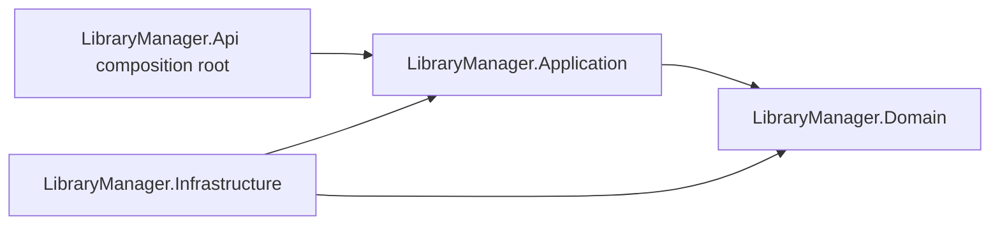

# Implementation Plan: Project Documentation

**Branch**: `003-project-documentation` | **Date**: 2026-08-27 | **Spec**: [spec.md](./spec.md)

**Input**: Feature specification from `/specs/003-project-documentation/spec.md`

**Note**: This template is filled in by the `/speckit-plan` command; its definition describes the execution workflow.

## Summary

Replace the repository-root `README.md` with a production-quality English delivery guide that an evaluator can follow without reading the source tree. Document **implemented** behavior from controllers, configuration, tests, Compose, Keycloak, and Kubernetes manifests—not the original challenge’s suggested API.

This feature is documentation-only. Do **not** change business implementation unless inspection finds a genuine code/OpenAPI inconsistency that blocks accurate documentation. Phase 0 inspection found **no** such inconsistency: book update is `PUT` (controllers and `specs/001-library-manager/contracts/openapi.yaml` agree); `GET /books/{id}/history` is an intentional alias of `GET /books/{id}/loans`; test-only `/security/*` and `/__test/unexpected-error` must stay out of the public API table.

No CQRS, MediatR, Command/Query/Handler types, or Generic Repository. Architecture is documented because it is implemented, emphasizing problems solved rather than scoring.

## Technical Context

**Language/Version**: Markdown (GitHub-flavored) for `README.md`; documented stack is C# / .NET 10 (`net10.0`)

**Primary Dependencies**: None added. Documented runtime: ASP.NET Core Web API, EF Core 10 / Npgsql, StackExchange.Redis, JWT Bearer + Keycloak OIDC (Authorization Code + PKCE), Swashbuckle, OpenTelemetry (stable packages; no `OpenTelemetry.Instrumentation.StackExchangeRedis`)

**Storage**: N/A for this feature. Documented system of record is PostgreSQL; Redis is availability cache-aside only (`library-manager:books:{bookId}:availability`, TTL 60s)

**Testing**: No new production tests required. README validation compares documented claims to existing xUnit + Testcontainers + `WebApplicationFactory` suites. After README rewrite: `dotnet build` and `dotnet test` must still pass (docs must not alter the application)

**Target Platform**: GitHub Markdown README; local evaluator path is Docker Compose (API `:8080`, Keycloak `:8081`)

**Project Type**: web-service documentation (existing Clean Architecture solution)

**Performance Goals**: N/A. Document 2–11 replica **correctness** from PostgreSQL + Outbox invariants, not throughput. Do not claim tests instantiate 11 hosts (they use two `WebApplicationFactory` hosts)

**Constraints**: English only; clickable TOC; no invented endpoints, env vars, statuses, secrets, or test counts; no Password Grant / Direct Access Grants as login; no claim that a Kubernetes cluster was deployed; no empty sections; merge related headings if needed while preserving all mandated information

**Scale/Scope**: Single file substantially rewritten: `README.md`. Spec artifacts under `specs/003-project-documentation/`. No new projects, packages, tables, or HTTP routes

## Constitution Check

*GATE: Must pass before Phase 0 research. Re-check after Phase 1 design.*

| Gate | Result | Evidence |
|------|--------|----------|
| I. English nomenclature and required project names | PASS | README English only; document existing project names; no new projects |
| II. Clean Architecture, UseCases, no CQRS/MediatR/Generic Repository | PASS | Architecture section must state four layers, inward dependencies, explicit UseCases, and that CQRS/MediatR/Generic Repository are not used |
| III. PostgreSQL-owned correctness; AuditEvent same transaction | PASS | Document atomic inventory SQL, no app/Redis locks, audit in the business transaction |
| IV. Durable PostgreSQL idempotency | PASS | Document `Idempotency-Key` header, endpoint `POST /loans`, unique `(endpoint, key)`, SHA-256 canonical `{bookId, userId}` |
| V. Transactional Outbox | PASS | Document same-transaction persist, `FOR UPDATE SKIP LOCKED` claim, lease, Redis I/O after claim commit, at-least-once, idempotent `DEL` |
| VI. API contracts | PASS | Document that HTTP types live under `LibraryManager.Api/Contracts/...`; do not invent DTOs |
| VII–XII. HTTP validation, binder, Result, localization, exception handler | PASS | Document existing `[ApiController]` 400, `IdempotencyKey` binder, Result→HTTP map, en-US/pt-BR, unexpected-only `IExceptionHandler` |
| XIII. SQL safety | PASS | Document parameterized `ExecuteSqlInterpolatedAsync`; distinguish from unsafe concatenation |
| Cache resilience / Security / Dependency security / Quality | PASS | Document decorator fallback, JWT resource server + PKCE, NuGet audit, Problem Details, `CancellationToken`—as implemented |

**Post-design re-check (Phase 1):** PASS. `data-model.md` models README documentation entities only (no schema change). `contracts/` catalogs endpoints, configuration keys, and test scenarios from source. `quickstart.md` validates the rewritten README against controllers, env sources, tests, Compose, and manifests without changing runtime code. No constitution violations.

## Project Structure

### Documentation (this feature)

```text
specs/003-project-documentation/
├── plan.md
├── research.md
├── data-model.md
├── quickstart.md
├── contracts/
│   ├── readme-outline.md
│   ├── endpoint-catalog.md
│   ├── configuration-catalog.md
│   └── test-matrix.md
├── checklists/
│   ├── requirements.md
│   └── readme.md
└── tasks.md                 # /speckit-tasks — not created by /speckit-plan
```

### Source Code (repository root)

```text
README.md                    # ONLY substantial deliverable (rewrite)

LibraryManager.sln
Directory.Build.props        # inspect NuGetAudit; do not change unless mismatch found
Dockerfile
docker-compose.yml
src/LibraryManager.Api/      # controllers, Contracts, Program.cs, appsettings*.json
src/LibraryManager.Application/
src/LibraryManager.Domain/
src/LibraryManager.Infrastructure/
tests/LibraryManager.UnitTests/
tests/LibraryManager.IntegrationTests/
infrastructure/keycloak/
deploy/kubernetes/           # manifests only; no live cluster in this repo
```

**Structure Decision**: Keep the existing four production projects and two test projects. Implementation work is the root `README.md`. Spec contracts are planning artifacts for authoring and validation, not a second public API.

## Complexity Tracking

No constitution violations. Documentation-only scope; no extra frameworks.

## Source inspection order (implement)

Before writing `README.md`, inspect in this order (re-verify at implement time; do not copy stale notes blindly):

1. **Root**: current `README.md`, `LibraryManager.sln`, `Directory.Build.props`, `Dockerfile`, `docker-compose.yml`, `src/LibraryManager.Api/appsettings.json`, `appsettings.Development.json`
2. **Challenge/specification**: `specs/001-library-manager/{spec,plan,tasks,contracts/openapi.yaml}`, `specs/002-production-hardening/{spec,plan}`, `.specify/memory/constitution.md`
3. **HTTP API**: all controllers, `Contracts/`, model binding, `LibrarianPolicy`, `Program.cs`, `ResultHttpMapper`, localization
4. **Application**: public UseCases, idempotency, cache, `ICurrentUserContext`, metrics abstractions
5. **Infrastructure**: DbContext, entity configs, migrations, `BookRepository` concurrency SQL, `IdempotencyStore`, Redis cache + decorator, `OutboxWriter` / `OutboxClaimer` / `OutboxProcessor`, DI
6. **Tests**: UnitTests, IntegrationTests, `CustomWebApplicationFactory`, two-host last-copy, idempotency, cache, Outbox, auth, audit, health, telemetry
7. **Deployment**: Keycloak realm JSON, `deploy/kubernetes/*`

If controllers and OpenAPI disagree at implement time: **report and stop guessing**; do not invent a blended contract (`spec.md` FR-004 / SC-012).

## README structure

Create `README.md` with these top-level sections. Do not create empty sections. Merge only as noted.

| # | Heading | Notes |
|---|---------|--------|
| 1 | library-manager | H1 title; one short positioning paragraph—not an architecture essay |
| 2 | Table of Contents | Clickable; every remaining H2 |
| 3 | Overview | Books, users/readers, loans, concurrency, idempotency, audit, Redis, observability, containers/K8s artifacts |
| 4 | Challenge Goals | Engineering problems evaluated—not Clean Architecture as a score |
| 5 | Key Engineering Highlights | Concise bullets/table: atomic PostgreSQL concurrency; durable `Idempotency-Key`; audit in business transactions; Redis cache-aside; Transactional Outbox; OIDC/JWT; OpenTelemetry; integration tests with real infrastructure |
| 6 | Technology Stack | Names from the repository |
| 7 | Architecture | Compact Mermaid **or** ASCII: API → Application → Domain; Infrastructure implements Application abstractions; composition root in `LibraryManager.Api`; no CQRS/MediatR/Generic Repository |
| 8 | Repository Structure | Important directories only |
| 9 | Prerequisites | Docker, Compose, .NET 10 SDK for host build/tests |
| 10 | Quick Start | Fresh clone path; Compose primary |
| 11 | Local Authentication with Keycloak | Actual container + Swagger PKCE; no manual JWT crafting for the standard flow |
| 12 | Configuration | Table from real keys only |
| 13 | Database and EF Core Migrations | PostgreSQL source of truth; Compose auto-apply; `dotnet ef database update` |
| 14 | API Reference | Summary table then details; no test-only routes |
| 15 | Domain and Business Rules | Book/user/loan/audit rules as implemented |
| 16 | Concurrency and Consistency | Last-copy diagram + SQL pseudocode + trade-offs |
| 17 | Idempotency | Ownership + behavior table |
| 18 | Domain Audit Trail | Actions + metadata |
| 19 | Redis Caching Strategy | Hit/miss/unavailable/invalidation/Outbox |
| 20 | Transactional Outbox | Diagram; Redis I/O **after** claim commit |
| 21 | Error Handling and Validation | 400/422/409/500 distinction |
| 22 | Localization | en-US/pt-BR (implemented and tested) |
| 23 | Observability | Logs, correlation, traces, custom metrics table, OTel |
| 24 | Health Checks | Operational semantics, not just routes |
| 25 | Testing Strategy | Unit vs integration; why not EF InMemory; Testcontainers; WAF. **H3 children:** Integration Test Coverage; Concurrent Last-Copy Test; Idempotency Tests; Cache and Outbox Tests. Auth and observability tests appear in the matrix / Observability (no empty extra H2s) |
| 26 | Docker | `Dockerfile` + Compose services + clean startup |
| 27 | Kubernetes | Manifests; challenge requires manifests **not** a running cluster |
| 28 | Why the System Remains Correct with 2–11 Replicas | DB + Outbox; two-host test generalizes; do not claim 11-host tests |
| 29 | Security Considerations | JWT validation, PKCE, parameterized SQL, secrets policy |
| 30 | Dependency Security | `Directory.Build.props` audit; commands |
| 31 | AI-Assisted / Spec-Driven Development | Short, non-promotional; engineer remains responsible |
| 32 | Known Limitations | Real only (see research.md) |
| 33 | Production Evolution | Sensible next steps; not implied defects |
| 34 | Engineering Decisions Summary | Problem → decision → trade-off table |

**Allowed merge:** items 26–29 in the user’s numbered list become H3 under Testing Strategy so the matrix is not duplicated. All required information is preserved.

## Quick Start commands (must be copyable)

Primary evaluator path:

```bash
git clone https://github.com/ronilsonsilva/library-manager.git
cd library-manager
docker compose up --build
```

Reset volumes:

```bash
docker compose down -v
```

Also document: `docker compose down` (stop without deleting volumes), API `http://localhost:8080`, Swagger `http://localhost:8080/swagger`, Keycloak `http://localhost:8081`, health URLs below.

Host alternatives (SDK required):

```bash
dotnet build
dotnet test
dotnet test tests/LibraryManager.UnitTests
dotnet test tests/LibraryManager.IntegrationTests
dotnet package list --vulnerable --include-transitive
dotnet package list --outdated
dotnet ef database update --project src/LibraryManager.Infrastructure --startup-project src/LibraryManager.Api
```

Do **not** hard-code unit/integration test counts.

## API Reference rules

1. Summary table: Method | Route | Authorization | Description for **every production** controller/health endpoint
2. Detailed subsections (examples) at minimum: Create Book, Update Book (`PUT`, not PATCH), Create User, Create Loan, Return Loan, Cancel Loan, Get Availability, Audit Events
3. `POST /loans` must include `Idempotency-Key`, body `{ bookId, userId }`, and statuses **201 / 400 / 401 / 403 / 404 / 409 / 422** with implemented semantics
4. Exclude `/security/me`, `/security/librarian-probe` (mapped only when `Testing:UseTestAuth`), and `/__test/unexpected-error` (Testing environment)

Authorization legend:

- **Librarian**: `Authorize(Policy = "Librarian")` → authenticated + role `librarian`
- **Authenticated**: `Authorize` (any valid JWT)
- **Anonymous**: health only among production routes

## Diagrams (concise)

**Architecture (Mermaid preferred if GitHub-safe):**



**Last-copy:**

```text
Replica A ----\
               -> PostgreSQL (atomic conditional UPDATE)
Replica B ----/
```

**Outbox:**

```text
Business transaction
  -> business state
  -> AuditEvent
  -> OutboxMessage
COMMIT
  -> immediate cache invalidation (best-effort)

Background OutboxProcessor
  -> claim FOR UPDATE SKIP LOCKED (commit lease)
  -> Redis invalidation (outside claim transaction)
  -> processed / retry
```

## Validation after writing README

1. Every documented endpoint vs controllers + 001 OpenAPI + Swashbuckle
2. Every environment variable vs appsettings / Compose / Kubernetes
3. Test scenarios vs actual test methods (omit rows with no test)
4. Architecture claims vs project references
5. Docker commands vs `docker-compose.yml` / `Dockerfile`
6. Kubernetes claims vs `deploy/kubernetes/`
7. No production secrets added
8. Markdown TOC/link/code-block sanity
9. `dotnet build` and `dotnet test` still pass

## Follow-up inspection notes (folded into contracts)

Source inspection after the first plan draft confirmed:

- PUT/history/test-only gating — no product-code change
- `POST /users` 201 has no Location; `POST /books` 201 does
- Pagination defaults 1/20, max 100, clamped
- Health writer is not Problem Details; ready does not check Keycloak
- Concurrent same-key: both 201, same loan id
- Outbox SKIP LOCKED dual-worker test is two worker ids, not two WAF hosts; processor off in integration WAF
- Observability tests cover four loan/cache meters only
- In-progress idempotency without a stored body → unexpected 500 (document as limitation, do not invent a wait API)

## Phase outputs

| Phase | Artifact |
|-------|----------|
| 0 | [research.md](./research.md) |
| 1 | [data-model.md](./data-model.md), [contracts/](./contracts/), [quickstart.md](./quickstart.md) |
| 2 | `tasks.md` via `/speckit-tasks` |
